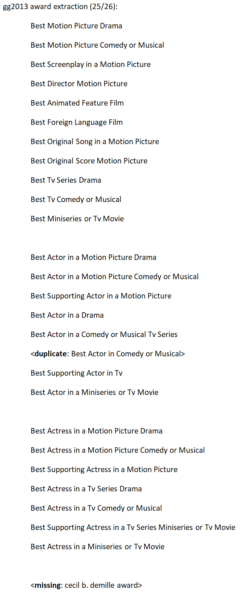
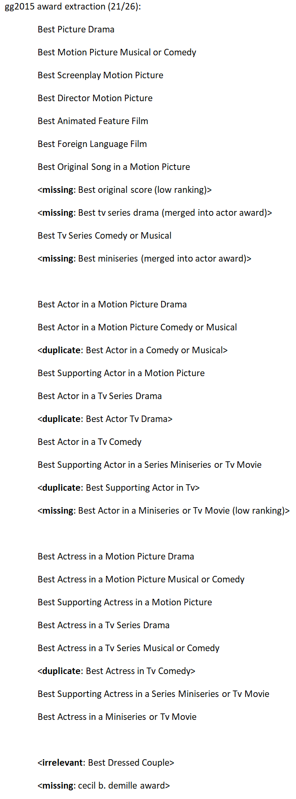

# CS337-Projects

## Project 1: Golden Globe Awards Extraction
- Complete basic tasks with good accuracy, and
- Fully parallelized the program using Ray

The program can be run from the terminal and the relevant award information will be printed in a human-readable format. JSON conversion of the results is implemented but not used for the auto-grader. Additional API integration for the autograder is done in gg_api.py, and gg_api.pre-ceremony() and gg_api.main() are called from within autograder.py. The program is tested with Python 3.10. 

The program retrieves the hosts accurately for both 2013 and 2015. The top 26 award titles extracted are returned to the autograder. The 25 regular awards are extracted almost exactly for both years, with minor spelling differences particularly for gg2013 due to low data volume. No keyword apart from 'Best' is used in finding award names from text or in excluding any extracted candidates. Iterative steps to merge sublists after re-ranking are taken to remove partial award names without erroneously merging representations for different awards. The occurrence frequencies for sublists are also properly added to the superlists which produces an accurate ranking of award mentions in the dataset. The autograder reports 0.255 completeness for 2013 award extraction but the actual completeness should be 25/26 as is documented in the images of the program outputs (manually sorted for clarity) included in this repository.

Hard-coded award names are then used to extract the winners, nominees and presenters for each award. The winners extraction accuracy is 100% in practice, minus the program's inability to discern abbreviations in names, such as Louis C.K.. Also, the best original song for gg2015 is returned as Glory, which is from Selma, but the correct answer is Selma.

The extracted winners are then used to find the earliest timestamp associated with the announcement of the winners. This proves a highly effective way to segment the ceremony by the award types. The award orders in the ceremony are extracted perfectly both for 2013 and 2015.

The information is then used to improve the extraction and re-ranking accuracy of the nominees and presenters. The nominees and presenters are first extracted using a set of heuristics, sorted into timeslots for the awards, and then combined both by merging sublists into superlists and soft merging substrings into superstrings by assigning the superstring a higher weight if the superstring has a comparable frequency in the dataset as the substring. On small datasets such as gg2013, an additional re-ranking step on the full data is performed to better identify real movies and names. This proves a fairly effective way to return the full names of the nominees and presenters without returning irrelevant functional words from the data. Winners and hosts are removed from the nominees and presenters, respectively. 

In practice, the program returns exact spellings for 38% and 44% of award nominees in 2013 and 2015, respectively, not including nearly correct spellings that miss punctuations in names. It also returns exact spellings for 70% and 65% of the presenters in 2013 and 2015, not including any partial representations of movies or names. The full string comparison evaluation functions for nominees and presenters are included in utils.py and can be called at the end of process(). The autograder returns a different completion score for some reason.

The program is fully parallelized in Ray which makes it a breeze to run on larger datasets such as the gg2015.json if multiple CPU cores are available. The program minimizes data copying in worker threads. It completed all extraction tasks for gg2015.json including multiple re-ranking steps in less than a minute on a server node, of which half the time was used in pd.read_json(). Modin was tested to further parallelize pandas operations but the gains were limited, so it was not included in the final version. On a quad-core laptop, the total run time is about 3 minutes. The number of (physical) CPU cores used can be configured in gg_api.pre_ceremony(), or in process.main().

## Project 2: Recipe Extraction and Transformation
- Completed basic tasks, and
- Two styles of cuisine (Chinese and Mexican)
- Double or half the serving size (including cooking time)
- Make recipe lactose-free 

The program is interactive and allows the user to make multiple transformations to a recipe or to start over after a transformation is complete by retrieving another recipe from AllRecipe.com. The program is tested with Python 3.10.

The program parses one or more methods from each step and links it with the relevant ingredients. A change in the ingredient will correctly display in the steps as well. The ingredient quantity uses fractional representation for visual appeal.

To make the recipe vegetarian, the program replaces non-vegetarian meat options with Impossible Meat variants. Other non-vegetarian proteins are replaced with tofu. Other non-vegetarian ingredients in the recipe such as chicken broth, beef broth or oyster sauce are also replaced with appropriate vegetarian substitutes. To make the recipe non-vegetarian, the inverse transformation is made.

To make the recipe healthy, non-vegetarian meat options are replaced with plant-based variants that are healthier, i.e. less fat and sodium. Unhealthy cheese and diary options such as whole milk are replaced with healthier options. Unhealthy cooking ingredients such as oil, salt and sweetners are retained but are reduced in quantity. Other condiments and carbohydrates that are less healthy are also replaced with healthier options. To make the recipe unhealthy, the inverse is applied.

When converting the recipe to the Chinese cuisine, the recipe is first categorized into five types. If proteins and carbs are present, the ingredients are used to make meat pies. If there are proteins but no other carbohydrate other than flour, a Chinese red-cooked dish is made. If it is a vegetable dish, it is blanched using a Chinese method. If it is a soup, a hot and sour flavor is added to it. Otherwise, a sticky rice and red bean paste dish is made with the main ingredients.

When converting the recipe to the Mexican cuisine, vegetables and peppers in the recipe are replaced with ones commonly found in traditional Mexican cuisine. Noodles and flour are replaced with corn. Two or more types of beans and one type of salsa is added. Finally, the dish is either served with tacos or corn tortillas for a healthy Mexican style meal. 

The recipe is made lactose-free (or nearly lactose-free) by substituting milk, cream and butter options with plant-based or lactose-free ones such as ultra-filtrated milk. Cheese options that are high in lactose are replaced with lactose-free or nearly lactose-free ones.